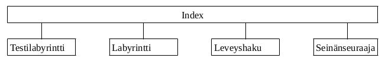

## Ohjelman yleisrakenne

- Index: ohjelman tämänhetkinen käyttöliittymä :) Ottaa yhteyden kaikkiin muihin
- Testilabyrintti: Antaa täsmälleen yhden listamuotoisen labyrintin, jota käytetään tällä hetkellä ohjelman ajamiseen
- Labyrintti: Sisältää labyrinttien lukemiseen, tietorakenteeseen ja graafiseen esitykseen käytetyn luokan
- Leveyshaku: Suorittaa leveyshaun ja palautaa ensimmäisen löytämänsä polun.
- Seinänseuraaja: Suorittaa seinänseuraaja-algoritmin, tuloksena tulisi aina olla ratkaisu jolla päästään alusta loppuun

## Saavutetut aika- ja tilavaativuudet
En tiedä vielä, mutta yritys on kova tietää aiheesta jotain ennen kuin työ pitäisi palauttaa. Myös algoritmien vertailu olisi tosi kiva.

## Työn mahdolliset puutteet ja parannusehdotukset
Kaikki :) Mutta yksityiskohtaisemmin:
- Joku muu kuin terminaaliin tulostuva vaiheiden kuvaus olisi äärimmäisen kiva ohjelmassa, jossa saatetaan tehdä kirjaimellisesti satoja välivaiheita :D
- Algoritmien olisi kiva olla esimerkiksi olemassa ja testatut
- Käyttöliittymä yleensäkin voisi olla jotain muuta kuin "mee indexiin ja paina play"
- Labyrintteja varten olisi kiva olla skripti, jolla voisi luoda tiettyjen vaatimusten mukaisia labyrintteja niin että algoritmeja voisi testata eri tyyppisillä 

## Lähteet
[Harabor, D. 5.5.2009, Clearance-based Pathfinding and Hierarchical Annotated A* Search](https://web.archive.org/web/20190411040123/http://aigamedev.com/open/article/clearance-based-pathfinding/), archive.org tiedosto, viitattu 10.11.2022

[Botea A., Müller M., Schaeffer J., 2004, Near optimal hierarchical path-finding (HPA*)](https://www.researchgate.net/publication/228785110_Near_optimal_hierarchical_path-finding_HPA)

Laaksonen, A. 2021. Tietorakenteet ja algoritmit. Kurssimoniste

[Wikipedia: Maze-solving algorithm](https://en.wikipedia.org/wiki/Maze-solving_algorithm), viitattu 10.11.2022, viimeksi editoitu 8.10.2022
